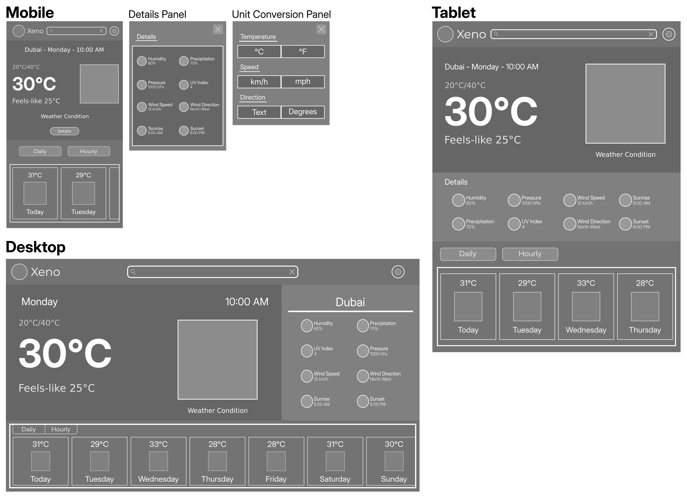

# Weather Web App

A responsive weather web application (in progress) that will provide real-time weather updates.  
This project demonstrates my skills in frontend development, geocoding, API integration, and responsive design.

## Project Status

- UI design: Wireframes and mockups designed
- Frontend development: Yet to build
- API integration: Yet to integrate a weather API

_This README will be updated as the project progresses._

## Wireframes & Mockups

### Wireframes

The wireframes outline the initial layout and structure of the app.  
  
Individual SVGs are stored in the [wireframes folder](./src/assets/wireframes/).

### Mockups

The mockups show the final design and styling of the app.  
  
Individual SVGs are stored in the [mockups folder](./src/assets/mockups/).
